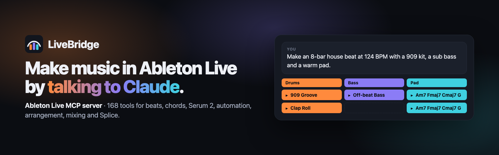
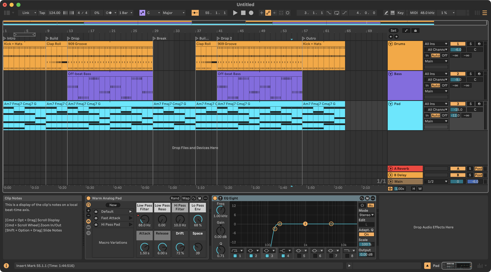

<p align="center">
  <a href="https://valentijnh.github.io/livebridge-ableton-mcp/"></a>
</p>

<h1 align="center">LiveBridge · Ableton Live MCP server for Claude</h1>

<p align="center">
  <strong>Make music in Ableton Live 12 by talking to Claude.</strong><br>
  168 tools for tracks, clips, MIDI, drums, chords, devices, Serum 2, automation, arrangement,
  mixing and Splice samples.<br>
  macOS and Windows · every Live 12 edition · no Max for Live · MIT licensed
</p>

<p align="center">
  <a href="https://github.com/valentijnh/livebridge-ableton-mcp/actions/workflows/tests.yml"></a>
  <a href="LICENSE"></a>
  
  
  
  <a href="https://modelcontextprotocol.io"></a>
  <a href="https://buymeacoffee.com/valentijnh"></a>
</p>

<p align="center">
  <a href="https://valentijnh.github.io/livebridge-ableton-mcp/"><b>Website</b></a> ·
  <a href="#quick-start"><b>Quick start</b></a> ·
  <a href="examples/"><b>Examples</b></a> ·
  <a href="examples/prompts.md"><b>100+ prompts</b></a> ·
  <a href="docs/TOOLS.md"><b>Tool reference</b></a> ·
  <a href="#faq"><b>FAQ</b></a>
</p>

> **You:** Make an 8-bar house beat at 124 BPM: a 909 kit, an off-beat sub bass on Am–F–C–G and
> a warm pad playing the chords. Keep the levels sensible.
>
> **Claude:** *sets the tempo, loads the 909 Core Kit, writes the drum pattern, loads a sub
> bass and a pad from Live's browser, writes the bassline and the chords with smooth voice
> leading, sets the levels in dB and names everything.* 17 tool calls, each one undo step in Live.
> [See every call →](examples/01-house-beat.md)
>
> **You:** Turn it into a full track: intro, a build-up with a clap roll and a filter sweep, the
> drop, a breakdown, a second build and drop, and an outro. Add locators.
>
> **Claude:** *writes the variations into scenes, sweeps the pad's filter through the build, lays
> out all seven sections in one call and adds the locators.*
> [See every call →](examples/05-song-structure.md)



<sub>Ableton Live 12.4.5 with the song from examples 1, 5 and 6, built through LiveBridge alone.</sub>

LiveBridge connects Claude (Claude Code, Claude Desktop or any MCP client) to a running
Ableton Live: transport, tracks, clips, MIDI notes, audio clips and samples, built-in devices,
third-party VST/AU plug-in parameters, the browser (instruments, effects, drum kits, presets,
packs, user library), automation, the arrangement, scenes, locators, mixer, routing, recording
and view navigation, plus Splice samples through Splice's official MCP server.

It works on **macOS and Windows**, with **every Live 12 edition** (built and verified against
Live 12.4.5 Suite), with Live on the same computer as Claude **or on another computer in your
network**, which is handy when you switch between a Mac and a Windows PC.

No Max for Live needed. Nothing is installed into Live except a small MIDI Remote Script.

## What you can ask

| You say | Claude does it with | Example |
|---|---|---|
| *"Make an 8-bar house beat at 124 BPM with a 909 kit"* | drum patterns by pad name, presets from Live's browser, a bassline, chords, levels in dB | [1](examples/01-house-beat.md) |
| *"Write a sad progression in D minor, a bassline and an arp, and check they fit"* | chords from symbols or Roman numerals, arpeggios, a music-theory check that finds clashes | [2](examples/02-chords-bass-arp.md) |
| *"Load Serum 2 and design a dark Reese bass"* | 120 Serum 2 parameters controllable without *Configure*, macros, LFO automation | [3](examples/03-serum-2-reese-bass.md) |
| *"Find a hi-hat loop on Splice and put it on a new track"* | Splice's official MCP server for search and download, LiveBridge for import and warping | [4](examples/04-splice-samples.md) |
| *"Turn this loop into a full track with a build-up and a breakdown"* | scenes, a clap roll, a filter sweep, the arrangement in one call, locators | [5](examples/05-song-structure.md) |
| *"Check my mix against my reference track"* | meters, a bounce, LUFS and spectrum comparison, EQ, side-chain, limiter | [6](examples/06-mix-check.md) |
| *"Connect to Live on my Windows PC"* | LAN mode with a token, discovery, file upload to the Live machine | [7](examples/07-two-computers.md) |
| *"Rename every clip after its track and scene"* | the whole Live Object Model, batches, Python inside Live | [8](examples/08-escape-hatches.md) |

More in the [prompt library](examples/prompts.md). Scripting Live without Claude:
[examples/python](examples/python/).

## Why LiveBridge

- **All of Live that its API allows**, not just transport and notes: 168 tools backed by 200
  commands, plus direct access to the Live Object Model for anything else.
- **Tools that think like a producer:** drum patterns written against the kit's pad names,
  chords from symbols or Roman numerals with voice leading, arps and basslines from a
  progression, humanize/swing/groove, section layouts, filter sweeps and LFOs, mixing in dB.
- **Ears, of a kind:** a music-theory check (key, chords, clashes between parts) and audio
  analysis (LUFS, spectrum, stereo, tempo, key), optionally against a reference track.
- **Big plug-ins, fully controllable:** Serum 2 and other VST3 synths without clicking
  *Configure* for every knob.
- **Splice in the same conversation**, through Splice's official MCP server.
- **Two computers:** Claude on your laptop, Live on the studio PC (or the other way round),
  with discovery and a token.
- **Safe to try:** every change is one undo step, the token protects the connection, LAN mode
  is opt-in and Python-in-Live can be switched off.
- **Tested:** 1,500+ unit tests on macOS, Windows and Linux, and end-to-end checks against a
  real Live 12.4.5.

## How it works

```
 Claude Code / Claude Desktop / any MCP client            + Splice's official remote MCP
            │  stdio (MCP)                                  (https://mcp.splice.com/mcp)
            ▼
 ┌───────────────────────────┐   TCP JSON lines :9880    ┌──────────────────────────────────┐
 │ livebridge-mcp            │ ────────────────────────▶ │ Ableton Live 12                  │
 │ MCP server (Python ≥3.10) │ ◀──────────────────────── │  └ LiveBridge Remote Script      │
 │ 168 tools, reconnecting   │   UDP discovery :9881     │    (stdlib Python 3.11 in Live,  │
 │ client, LAN discovery     │ ◀ ─ ─ ─ ─ ─ ─ ─ ─ ─ ─ ─ ─ │     runs every command on Live's │
 └───────────────────────────┘                           │     main thread, 1 undo step each)│
                                                         └──────────────────────────────────┘
```

1. **Remote Script** (`remote_script/LiveBridge`) — loaded by Live as a control surface. It runs a
   small TCP server on a background thread and executes every command on Live's main thread
   against the Live Object Model (LOM). Every change is one undo step.
2. **MCP server** (`mcp_server`, package `livebridge-mcp`) — exposes curated, validated tools to
   Claude and talks to the Remote Script (reconnects automatically, finds Live on the LAN).
3. **Installer** (`installers/`) — copies the script into Live's User Library, writes the config
   with a random token, installs the MCP server, registers it (and Splice) with Claude and
   installs the LiveBridge skill for Claude Code and Claude Desktop.

Design and wire protocol: [docs/ARCHITECTURE.md](docs/ARCHITECTURE.md),
[docs/PROTOCOL.md](docs/PROTOCOL.md).

## Quick start

Requirements: Ableton Live 12 (any edition), Python 3.10+ for the MCP server
([python.org](https://www.python.org/downloads/); the installer itself runs on 3.9+ and can use
[uv](https://docs.astral.sh/uv/) with `--uv` to fetch Python for you), and Claude Desktop and/or
Claude Code. Node.js (`npx`) is only needed for Splice in Claude Desktop's JSON config.

### macOS

```bash
git clone https://github.com/valentijnh/livebridge-ableton-mcp.git LiveBridge && cd LiveBridge
./installers/install.sh            # or: python3 installers/install.py
```

### Windows (PowerShell)

```powershell
git clone https://github.com/valentijnh/livebridge-ableton-mcp.git LiveBridge; cd LiveBridge
powershell -ExecutionPolicy Bypass -File installers\install.ps1   # or: py installers\install.py
```

### Then, on both

1. Start (or restart) Live.
2. **Live → Preferences → Link, Tempo & MIDI → Control Surface → LiveBridge** (Input/Output: None).
   The status bar says `LiveBridge … ready on port 9880`.
3. Restart Claude Desktop / open a new Claude Code session and ask: *"run live_status"*.
4. Claude Desktop only: upload the skill the installer built — **Settings → Capabilities → Skills →
   Upload skill →** `~/.livebridge/livebridge-skill.zip` (Claude Code gets it automatically).

Try: *"Make a 4-bar house beat at 124 BPM with a 909 kit, a sub bass following Am–F–C–G and a
pad on the chords, then loop it."*

The installer is idempotent — run it again after `git pull` to update; it keeps the token and
every setting you do not pass again (LAN mode, port, `allow_eval`, paired host). `--dry-run` shows
every action without writing anything. Details, flags and manual setup:
[docs/INSTALL.md](docs/INSTALL.md).

## Two machines (Mac ↔ Windows, LAN)

Live runs on one computer, Claude on another:

```bash
# on the computer that runs Live — listen on the LAN, prints the token and this machine's IP
python installers/install.py --network

# on the computer that runs Claude
python installers/install.py --pair 192.168.1.20 --token <token printed above>
```

At runtime Claude can find Live instances with `live_discover` (UDP beacon) and switch with
`live_connect(host, port, token, persist=true)`. Firewall: the **Live** machine needs incoming
TCP 9880; the **Claude** machine needs incoming UDP 9881 only for `live_discover` (the beacon
travels from Live to Claude). On macOS 15+ allow Claude (or your terminal) and Live under
*Privacy & Security → Local Network* — otherwise connecting fails with "No route to host".
`install.py --local` makes a machine standalone again. See [docs/NETWORK.md](docs/NETWORK.md).

No git remote to clone from on the second computer? `python installers/bundle.py` packs this
folder into `dist/LiveBridge-<version>.zip`; unzip it on the other computer into a folder you
keep (the MCP server is installed from it — moving it later means re-running the installer) and
run the installer there ([details](docs/INSTALL.md#getting-livebridge-onto-the-other-computer)).

## Splice

LiveBridge does not reimplement Splice: the installer registers Splice's official remote MCP
(`https://mcp.splice.com/mcp`) next to LiveBridge (disable with `--no-splice`). Claude searches and
downloads sounds with the Splice tools (search is free; downloads need a paid plan and are limited
to 100 per 24 h), then `live_splice_import_downloaded(files=[<paths Splice reported>])` puts them
into Live (session slot, arrangement, Simpler or a Drum Rack pad). When Live runs on another
computer LiveBridge sends the files over first (into `<User Library>/Samples/LiveBridge` there).
`live_splice_watch_folder` is for downloads you make by hand in the Splice app or browser;
`live_splice_setup_info` explains the setup from inside Claude.

## Serum 2 and other big plug-ins

Live exposes **none** of a big plug-in's parameters after loading (Serum 2 VST3/AU: 0 of 2623)
— only what the device's *Configure* list holds, and Live's API cannot add to it. LiveBridge gets
around that without a click: it writes a rack preset that lists the wanted VST3 parameters and
loads the plug-in inside it.

1. `live_plugin_expose(plugin="Serum 2", parameters=["sound_design"], new_track=true)` — a
   curated set of 120 sound-design controls (oscillators, sub/noise, filters, envelopes, LFO
   rates, macros, FX slots); add names or groups as needed. Optional `macros={"1": "Filter 1
   Freq"}` wires rack macros.
2. `live_device_set_parameters` on the returned `device` path with display strings
   (`{"Filter 1 Freq": "800 Hz", "Env 1 Attack": "20 ms", "A Octave": "-1 oct", "Main Vol": "70%"}`).
3. Automate them like any parameter (`live_automation_write`, `live_automation_record`).

Starting sounds: `live_plugin_preset_files(plugin="Serum 2")` → `preset_file=`. Other VST3
plug-ins: `live_plugin_param_map(plugin=...)` once (probes ~30 s), then expose. Limits: 128
parameters per rack, the sound restarts from the preset/template when you re-expose,
`.SerumPreset` files cannot be embedded, Audio Units expose nothing this way (prefer VST3); the
manual Configure route remains for AU / VST2. Details: [docs/PLUGIN_RACKS.md](docs/PLUGIN_RACKS.md).

## Tools

168 tools, named `live_<area>_<verb>`, backed by 200 bridge commands in the Remote Script. The
full reference (every tool with its arguments and defaults, and every bridge command with the tool
that runs it) is [docs/TOOLS.md](docs/TOOLS.md), generated from the code by
`installers/gen_tools_doc.py`; Claude reads the full docstrings at runtime.

The same argument forms work in every tool: `track` = index, name, return letter (`"A"`),
`"master"`, `"selected"` or a LOM path; `slot` = scene index or name; `clip` = path, name or
`"selected"`; song positions and clip lengths are beats or `"17.1.1"` (bars.beats.sixteenths);
colours are a palette index, `"#RRGGBB"`, `[r, g, b]` or a name.

| Area | Examples | What you can do |
|---|---|---|
| Session & status | `live_status`, `live_set_snapshot`, `live_connect`, `live_discover` | Connection check, the whole set in one call, switch machines |
| Transport | `live_transport_play/stop/set/set_loop/undo` | Tempo, signature, metronome, loop, quantization, scale, undo/redo |
| Tracks & mixer | `live_tracks_create/set/delete/duplicate`, `live_mixer_set/set_many/master` | Create/rename/colour/arm tracks; volume/pan/sends in dB |
| Routing & recording | `live_routing_route/set`, `live_record_session/arrangement/resample/capture_midi`, `live_mixer_meters` | Resampling/bounce, buses, side-chain; record clips; capture MIDI; level meters |
| Clips & notes | `live_clip_create/set/fire`, `live_clip_add_notes`, `live_clip_write_pattern/write_chords/write_arp`, `live_clip_transform_notes`, `live_clip_warp/convert`, `live_groove_pool` | Step-sequenced drums, chords and arps from symbols or Roman numerals, quantize/humanize/transpose, warp markers, audio → MIDI |
| Arrangement & locators | `live_arrangement_overview/from_scenes/duplicate_clip/resize_clip/copy_range`, `live_cue_layout/add`, `live_time_convert` | Session → arrangement, song sections, bars ↔ beats |
| Scenes | `live_scene_create/fire/set/capture` | Scene tempo/signature, launch, capture |
| Devices & racks | `live_device_insert/set_parameter/set_parameters/randomize`, `live_rack_macros`, `live_drumrack_overview`, `live_simpler_*` | Any parameter by name/display text ("-12 dB", "1/8"), macros, drum pads, Simpler |
| Plug-ins | `live_plugin_expose/param_map/preset_files`, `live_plugin_list/presets/set/parameters` | Serum 2 / any VST3 fully controllable without Configure; presets and exposed parameters |
| Browser | `live_browser_search/load/hotswap/preview` | Load anything from Live's browser by name (`category="instrument"`, `"drum_kit"`, `"plugin"` …) |
| Samples & Splice | `live_sample_import/upload/list`, `live_drumrack_set_pad/convert`, `live_splice_import_downloaded` | Files from disk (or from Claude's machine in LAN mode) into slots, the arrangement, Simpler or drum pads |
| Automation | `live_automation_write/shape/get/copy/clear/state`, `live_automation_record` | Envelopes and LFO shapes in session clips; arrangement automation recorded in real time |
| Analysis | `live_theory_analyze`, `live_audio_analyze` | Key, chords, clashes between MIDI parts; LUFS, spectral balance, stereo, tempo, key and energy curve of audio (optional `audio` extra), compared with a reference track |
| View | `live_view_select/show/navigate/selection` | Show what Claude works on, follow the user's selection |
| Escape hatches | `live_lom_get/set/call/describe/children`, `live_eval_python`, `live_commands`, `live_command_call`, `live_command_batch`, `live_dialog_get/press` | Anything else in the Live Object Model; any bridge command without a curated tool; many commands as one undo step; Live's dialogs |

A Claude skill with a production workflow ships in
[.claude/skills/livebridge/SKILL.md](.claude/skills/livebridge/SKILL.md). The installer copies it
to `~/.claude/skills/livebridge` (Claude Code, every folder) and packs
`~/.livebridge/livebridge-skill.zip` for Claude Desktop (Settings → Capabilities → Skills →
Upload skill); `--no-skill` skips that. MCP clients without the skill can read the same text as
the resource `livebridge://skill` or the prompt `livebridge_workflow`. The musical side — song
structure, energy, build-ups, transitions, effect chains, mix targets per genre — is in
[PRODUCTION.md](.claude/skills/livebridge/PRODUCTION.md) next to it (resource
`livebridge://production`). Fewer tools in context:
`--toolsets core` ([details](docs/INSTALL.md#fewer-tools-toolsets)).

## Limitations

These are limits of Live's Python API, not of LiveBridge (details and alternatives in
[docs/LIVE_API_NOTES.md](docs/LIVE_API_NOTES.md)):

- No saving the set, no audio file export, no freeze/flatten, no grouping tracks, no menu
  commands or preferences. A section or a track can be bounced to audio in real time
  (`live_record_resample`).
- Racks: no macro mapping, no deleting/reordering chains, no key/velocity zones, no saving
  presets; Sampler zones and the Drum Sampler's sample are not reachable (workarounds in
  LIVE_API_NOTES §12).
- Automation is drawn into **session clips**; arrangement automation lanes are recorded in real
  time (`live_automation_record`). Clip envelopes survive the copy to the arrangement only on
  tracks without an instrument (Live 12.4.5) — LiveBridge reports it.
- Third-party plug-ins expose only the parameters in their Configure list (at most 128). For
  VST3 plug-ins `live_plugin_expose` builds that list without a click (Serum 2 fully mapped);
  AU / VST2 plug-ins need the device's **Configure** button once.
- `live_device_insert` (built-in devices without the browser) needs Live 12.3+; older 12.x load
  through the browser tools.
- Claude cannot hear audio, but can read Live's level meters and CPU load (`live_mixer_meters`)
  and works from the set's data (notes, parameters, names).
- `live_eval_python` runs arbitrary Python inside Live; it is on by default for the owner, always
  behind the token, and can be disabled with `--no-allow-eval`.

## FAQ

**Which Ableton Live versions and editions work?**
Live 12, in every edition. It was built and verified against Live 12.4.5 Suite;
`live_device_insert` needs 12.3 or later, and older 12.x versions load devices through the
browser tools instead. Some example presets are Suite content; other editions use their own. Live 11 is not supported: the Remote Script is
written for the Python 3.11 that Live 12 embeds.

**Do I need Max for Live?**
No. LiveBridge is a MIDI Remote Script, the same kind of script that drives Push and other
controllers, so it runs in every edition.

**Which AI apps can use it?**
Claude Code and Claude Desktop; the installer sets both up, including the LiveBridge skill.
Any other MCP client that can start a local (stdio) server works too: run `livebridge-mcp`
([mcp_server/README.md](mcp_server/README.md)).

**Can Claude hear my music?**
Not directly. Claude reads what Live knows (notes, devices, parameters, levels), checks harmony
with `live_theory_analyze` and measures bounced audio with `live_audio_analyze`: loudness,
spectrum, stereo, tempo and key. Your ears still have the final say.

**Is it free?**
LiveBridge is free and open source (MIT). You need Ableton Live 12 and a Claude plan; Splice is
optional (searching is free, downloads use your Splice credits). If it helps your music, you can
[buy me a coffee](https://buymeacoffee.com/valentijnh).

**Does it work on Windows? With Live and Claude on different computers?**
Yes to both: macOS and Windows, and Claude and Live can run on two computers in your network,
Mac and PC mixed ([example 7](examples/07-two-computers.md), [docs/NETWORK.md](docs/NETWORK.md)).

**Will it mess up my set?**
Every change is one undo step (Cmd/Ctrl+Z). The skill tells Claude to ask before deleting or
overwriting your material and not to start playback or recording unless asked. Work on a copy
of an important set anyway, and save it yourself: Live's API cannot save.

**Is it safe to run?**
By default Live only accepts connections from the same computer, with a random token. LAN mode
is opt-in, still requires the token, and is meant for your own network. Python-in-Live
(`live_eval_python`) can be switched off with `--no-allow-eval`. See [SECURITY.md](SECURITY.md).

**How does it compare with other Ableton MCP servers?**
Beyond the basics (transport, tracks, clips and notes) LiveBridge covers the browser, devices and
racks, third-party plug-in parameters (Serum 2 without *Configure*), automation in clips and the
arrangement, song structure, routing and side-chains, resampling, the theory and audio
analysis, Splice, two-computer setups, and direct access to the Live Object Model. Every tool is
tested against a simulated Live on macOS, Windows and Linux.

## Troubleshooting

Script not listed in Live, port in use, token mismatch, firewall, timeouts, plug-in parameters
missing, Windows path escaping and where `Log.txt` lives: [docs/TROUBLESHOOTING.md](docs/TROUBLESHOOTING.md).
`python tests/integration_check.py` checks a real Live end to end (and cleans up after itself);
`--scenario beat` runs the whole beat-making chain on temporary tracks, `--scenario arrangement`
the arrangement copy/resize/move chain.

## Development

```bash
python3 -m venv .venv && .venv/bin/pip install -e "mcp_server[dev]"
.venv/bin/python -m pytest -q tests      # fake `Live` package in tests/live_stub, no Live needed
```

Handlers (`remote_script/LiveBridge/handlers/*.py`) and MCP tools
(`mcp_server/livebridge_mcp/tools/*.py`) are auto-discovered — add a file, never edit a registry.
The Remote Script is standard-library only and must stay Python 3.11 compatible. Shared argument
parsing (tracks, devices, colours, times, paging) lives in `remote_script/LiveBridge/resolve.py`.
After adding or changing a tool or command, regenerate the reference:
`.venv/bin/python installers/gen_tools_doc.py` (`tests/test_consistency.py` fails when it is stale).
More in [CONTRIBUTING.md](CONTRIBUTING.md); changes per version in [CHANGELOG.md](CHANGELOG.md).

## Support

LiveBridge is free. If it saves you time or sparks a track, you can
[buy me a coffee](https://buymeacoffee.com/valentijnh) ☕. A star on GitHub, a bug report or a note
about what you made with it helps just as much.

## License

MIT — see [LICENSE](LICENSE). Ableton and Live are trademarks of Ableton AG; Splice is a trademark
of Splice. LiveBridge is an independent project and not affiliated with either.
