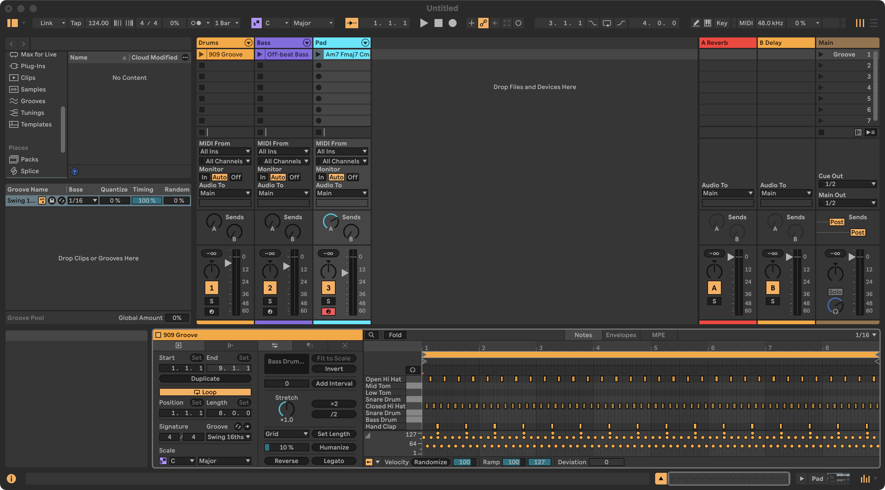

# 1 · An 8-bar house beat

> **You:** Make an 8-bar house beat at 124 BPM: a 909 kit, an off-beat sub bass on Am–F–C–G and
> a warm pad playing the chords. Keep the levels sensible.

|  |  |
|---|---|
| **Shows** | step-sequenced drums, presets from Live's browser, a bassline written as a pattern, chords with voice leading, mixing in dB |
| **Needs** | any Live 12 edition (the presets are in Live's Core Library) |
| **Tool calls** | 17 · about 20 seconds |

## What Claude does

**1. Check the connection and read the set.**

```python
live_status()
live_set_snapshot(detail="minimal")
```

`live_status` answers with the Live version and edition (`"version": "12.4.5", "edition":
"suite"`). The snapshot lists every track, return and scene with the `path` later calls use.

**2. Tempo.**

```python
live_transport_set(tempo=124, signature="4/4")
```

**3. Drums: the 909 kit on a new track and an 8-bar pattern.**

```python
live_browser_load(query="909 Core Kit", category="drum_kit", new_track=true, track_name="Drums")

live_clip_write_pattern(track="Drums", slot=0, repeat=8, pattern={
    "kick": "x...x...x...x...",
    "clap": "....X.......X...",
    "ohh":  "..x...x...x...x.",
    "hat":  ".o.o.o.o.o.o.o.o",
})
```

One string per drum, one character per 16th note: `x` hit, `X` accent, `o` ghost note, `.` rest.
Drum names are matched to the kit's own pad names, so the pattern works with any kit:

```json
{"added": 144, "length": 32,
 "kit": {"device": "909 Core Kit", "rows": {
   "kick": {"note": 36, "pad": "Bass Drum"},
   "clap": {"note": 39, "pad": "Hand Clap"},
   "ohh":  {"note": 46, "pad": "Open Hi Hat"},
   "hat":  {"note": 42, "pad": "Closed Hi Hat"}}}}
```

**4. Bass: a sub bass preset and an off-beat line that follows the chords, two bars per chord.**

```python
live_browser_load(query="Sub Bass", category="instrument", new_track=true, track_name="Bass")

live_clip_write_pattern(track="Bass", slot=0, step="1/8", gate=0.7, pattern={
    "A1": ".x.x.x.x|.x.x.x.x|........|........|........|........|........|........",
    "F1": "........|........|.x.x.x.x|.x.x.x.x|........|........|........|........",
    "C2": "........|........|........|........|.x.x.x.x|.x.x.x.x|........|........",
    "G1": "........|........|........|........|........|........|.x.x.x.x|.x.x.x.x",
})
```

`query="Sub Bass"` loads the best match from the browser (here *Hip-Hop Sub Bass*) and lists
the runners-up in `alternatives`. With `step="1/8"` every character is an eighth note, so
`.x.x.x.x` is the classic off-beat house bass; `|` only makes the bars readable.

**5. Pad: a warm analog pad playing the progression with smooth voice leading.**

```python
live_browser_load(query="Warm Analog Pad", category="instrument", new_track=true, track_name="Pad")

live_clip_write_chords(track="Pad", slot=0, chords="Am7 Fmaj7 Cmaj7 G",
                       duration=8, octave=3, voice_leading=true, velocity=80)
```

```json
{"chords": [
  {"chord": "Am7",   "start": 0,  "notes": ["A3", "C4", "E4", "G4"]},
  {"chord": "Fmaj7", "start": 8,  "notes": ["A3", "C4", "E4", "F4"]},
  {"chord": "Cmaj7", "start": 16, "notes": ["B3", "C4", "E4", "G4"]},
  {"chord": "G",     "start": 24, "notes": ["B3", "D4", "G4"]}]}
```

`voice_leading=true` picks the inversions that move least: from Am7 to Fmaj7 only the G steps
down to F.

**6. Mix in dB, with some reverb on the pad.**

```python
live_mixer_set_many(settings=[
    {"track": "Drums", "volume": "-6 dB"},
    {"track": "Bass",  "volume": "-9 dB"},
    {"track": "Pad",   "volume": "-15 dB", "sends": {"A": "-12 dB"}},
])
```

**7. Name and colour what it made**, so you recognise it in your set.

```python
live_tracks_set(track="Drums", color="orange")
live_tracks_set(track="Bass", color="purple")
live_tracks_set(track="Pad", color="cyan")
live_clip_set(track="Drums", slot=0, name="909 Groove", color="orange")
live_clip_set(track="Bass", slot=0, name="Off-beat Bass", color="purple")
live_clip_set(track="Pad", slot=0, name="Am7 Fmaj7 Cmaj7 G", color="cyan")
```

**8. Name the scene and play it.**

```python
live_scene_set(scene=0, name="Groove")
live_scene_fire(scene="Groove")
```

## What you get



Three new tracks, each with an 8-bar clip in the scene *Groove*: **Drums** (909 Core Kit),
**Bass** (Hip-Hop Sub Bass) and **Pad** (Warm Analog Pad), at −6, −9 and −15 dB, with the pad
sent to the reverb return. Every step is one undo step in Live, so Cmd/Ctrl+Z walks it back.

## Take it further

- *"Swing the hats a little."*
  ```python
  live_clip_transform_notes(track="Drums", slot=0, pitch=["F#1", "A#1"],
                            quantize="1/16", swing=0.2)
  ```
- *"Make it techno: 132 BPM, straight 16th hats, no clap."*
  ```python
  live_transport_set(tempo=132)
  live_clip_write_pattern(track="Drums", slot=0, repeat=8, pattern={
      "kick": "x...x...x...x...", "hat": "xxxxxxxxxxxxxxxx", "ohh": "..x...x...x...x."})
  live_clip_remove_notes(track="Drums", slot=0, pitch="D#1")
  ```
- *"Duck the bass under the kick."* → the side-chain in [example 6](06-mix-check.md).
- *"Now turn it into a song."* → [example 5](05-song-structure.md).
