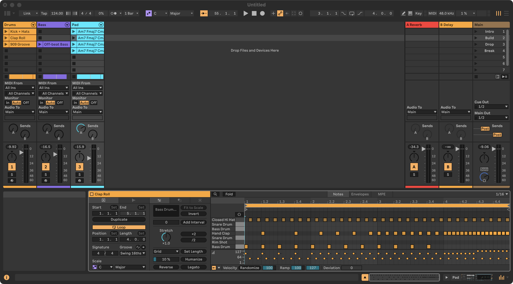

# 5 · From loop to song

> **You:** Turn the house loop into a full track: intro, a build-up with a clap roll and a
> filter sweep, the drop, a breakdown, a second build and drop, and an outro. Add locators for
> every section.

|  |  |
|---|---|
| **Shows** | variations in scenes, a drum roll written as a pattern, a filter sweep on a rack macro, the whole arrangement laid out in one call, locators, the arrangement as a text picture |
| **Starts from** | the beat from [example 1](01-house-beat.md) (tracks Drums, Bass, Pad) |
| **Tool calls** | 13 |

## What Claude does

**1. Scenes for the sections.** The existing scene becomes the drop; three new ones go around it.

```python
live_scene_set(scene="Groove", name="Drop")
live_scene_create(index=0, name="Intro")
live_scene_create(index=1, name="Build")
live_scene_create(index=3, name="Break")
```

**2. Drum variations: kick and hats for the intro, a 4-bar clap roll for the build** (kick
drops out in the last bar).

```python
live_clip_write_pattern(track="Drums", slot="Intro", repeat=4, pattern={
    "kick": "x...x...x...x...", "ohh": "..x...x...x...x.", "hat": ".o.o.o.o.o.o.o.o"})

live_clip_write_pattern(track="Drums", slot="Build", pattern={
    "kick": "x...x...x...x...|x...x...x...x...|x...x...x...x...|................",
    "clap": "....x.......x...|..x...x...x...x.|x.x.x.x.x.x.x.x.|xxxxxxxxXXXXXXXX",
    "hat":  ".o.o.o.o.o.o.o.o|.o.o.o.o.o.o.o.o|.o.o.o.o.o.o.o.o|.o.o.o.o.o.o.o.o"})
```

**3. The pad in every section.**

```python
live_clip_duplicate(track="Pad", slot="Drop", target_slot="Intro")
live_clip_duplicate(track="Pad", slot="Drop", target_slot="Build")
live_clip_duplicate(track="Pad", slot="Drop", target_slot="Break")
```

**4. A filter sweep through the build.** The *Warm Analog Pad* preset is a rack whose first
macro is its low-pass filter; `live_rack_macros(track="Pad")` shows that. The name also exists
inside the rack, so the first try answers with both candidates:

```json
{"error": "... parameter 'Low Pass Filter' is ambiguous on 'Pad': Warm Analog Pad > Low Pass Filter (song.tracks[2].devices[0].parameters[1]), Warm Analog Pad > Drift > Drift > Low Pass Filter (...) — pass device= or the path.",
 "type": "bad_args"}
```

so Claude names the rack:

```python
live_automation_shape(track="Pad", slot="Build", device="Warm Analog Pad",
                      parameter="Low Pass Filter", shape="ramp_up",
                      start=0, end=16, low=0.2, high=0.9, mode="events")
```

The macro rises from 25 to 114 (of 127) over the 4 bars.

**5. The whole song in one call:** each scene becomes a section, and every clip is copied and
looped to fill it.

```python
live_arrangement_from_scenes(sections=[
    {"scene": "Intro", "bars": 8}, {"scene": "Build", "bars": 4},
    {"scene": "Drop", "bars": 16},  {"scene": "Break", "bars": 8},
    {"scene": "Build", "bars": 4},  {"scene": "Drop", "bars": 16},
    {"scene": "Intro", "bars": 8},
])
```

```json
{"sections": [
  {"name": "Intro", "start_bar": "1.1.1",  "tracks": ["Drums", "Pad"]},
  {"name": "Build", "start_bar": "9.1.1",  "tracks": ["Drums", "Pad"]},
  {"name": "Drop",  "start_bar": "13.1.1", "tracks": ["Drums", "Bass", "Pad"]},
  {"name": "Break", "start_bar": "29.1.1", "tracks": ["Pad"]},
  {"name": "Build", "start_bar": "37.1.1", "tracks": ["Drums", "Pad"]},
  {"name": "Drop",  "start_bar": "41.1.1", "tracks": ["Drums", "Bass", "Pad"]},
  {"name": "Intro", "start_bar": "57.1.1", "tracks": ["Drums", "Pad"]}],
 "end_bar": "65.1.1", "placed": 15}
```

**6. Locators for every section.**

```python
live_cue_layout(cues=[
    {"name": "Intro", "bar": 1},    {"name": "Build", "bar": 9},
    {"name": "Drop", "bar": 13},    {"name": "Break", "bar": 29},
    {"name": "Build 2", "bar": 37}, {"name": "Drop 2", "bar": 41},
    {"name": "Outro", "bar": 57},
])
```

**7. Check the result.**

```python
live_arrangement_overview(unit="bars")
```

Each track's `lane` has one character per bar (`#` = a clip plays), so Claude can see the
structure at a glance:

```json
{"cue_points": [["Intro", 0], ["Build", 32], ["Drop", 48], ["Break", 112],
                ["Build 2", 144], ["Drop 2", 160], ["Outro", 224]],
 "tracks": [
  {"name": "Drums", "lane": "############################........############################"},
  {"name": "Bass",  "lane": "............################............################........"},
  {"name": "Pad",   "lane": "################################################################"}]}
```

## What you get


A 64-bar, two-minute arrangement with locators you can jump between (`live_cue_jump`), and the
scenes still in the Session View for jamming:



(The EQ Eight under the pad in the first screenshot comes from [example 6](06-mix-check.md).)

**One Live limitation to know:** clip envelopes on tracks *with an instrument* are not copied
to the arrangement (Live 12.4.5), so the sweep plays in the Session View only. For the
arrangement Claude records it as track automation: Live plays bars 9–13 in real time while
LiveBridge turns the knob.

```python
live_automation_record(track="Pad", device="Warm Analog Pad", parameter="Low Pass Filter",
                       shape="ramp_up", start="9.1.1", end="13.1.1", low=0.2, high=0.9)
```

## Take it further

- *"Add a crash on every section start."* → `live_arrangement_create_clip` plus notes on the
  crash pad.
- *"Make the break longer and the second drop hit harder."* → edit the sections and run
  `live_arrangement_from_scenes` again (`replace=true` is the default).
- *"Bounce it."* → `live_record_resample(start="1.1.1", bars=64)` records the master in real time.
